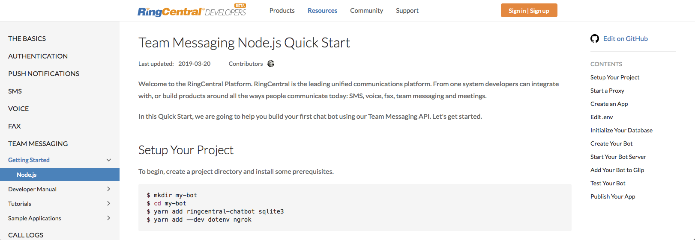

no_breadcrumb:True

# Moonstone Theme for MkDocs

The Moonstone theme is a clean, responsive, configurable theme for the MkDocs documentation system. It utilizes the Bootstrap CSS Framework and parts of the Material library for authoring code. 

## Features

- Navigation and TOC
- Bootstrap4 CSS support
- Material design elements
- Enhanced Syntax Highlighting
- Search

## Sample Sites

### RingCentral's Developer Site

[Visit site](http://developers.ringcentral.com/guide)

### Share your site

Are you using Moonstone? [Tell us](https://github.com/byrnereese/mkdocs-bootstrap-tables-plugin/issues) if you would like us to include a screenshot!